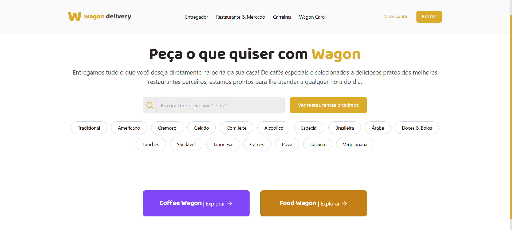
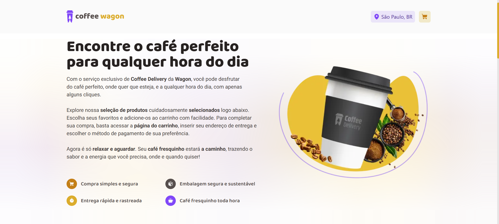
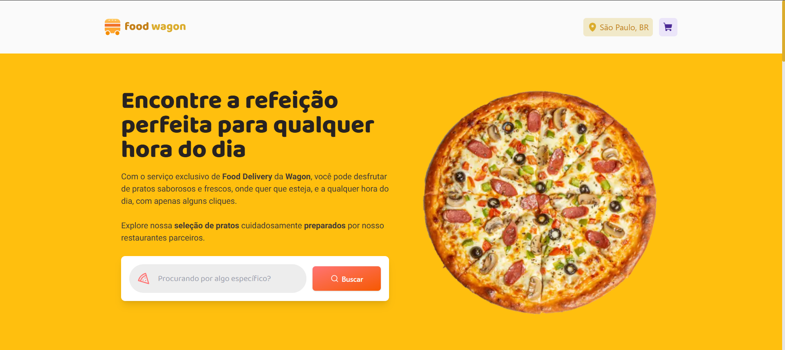

# 🚚 WagonDelivery

> Plataforma de entrega digital fácil, rápida e moderna, construída com as melhores tecnologias de front-end!

**WagonDelivery** é um projeto desenvolvido durante as aulas de **Desenvolvimento WEB** do curso de graduação de Engenharia de Computação da Universidade Pontifícia Católica de Campinas (**PUC-Campinas**), que visa otimizar a logística de entrega digital. Utilizando o poder de **React**, **Next.js** e **TailwindCSS**, a plataforma fornece uma experiência de usuário elegante, funcional e escalável. **Clerk** é utilizado para gerenciar autenticação e controle de acesso, enquanto **Shadcn** auxilia com componentes de UI estilizados e personalizados.

---





## 📋 Sumário

- [🚚 WagonDelivery](#-wagondelivery)
  - [📋 Sumário](#-sumário)
  - [✨ Recursos](#-recursos)
  - [🧠 Tecnologias](#-tecnologias)
  - [🛠️ Pré-requisitos](#️-pré-requisitos)
  - [🚀 Instalação](#-instalação)
  - [🏃‍♂️ Utilização](#️-utilização)
  - [📂 Estrutura de Arquivos](#-estrutura-de-arquivos)
  - [🤝 Colaboradores](#-colaboradores)

---

## ✨ Recursos

- **Interface Moderna:** Experiência de usuário rica e interativa com **React** e **Next.js**
- **Autenticação Segura:** Controle de autenticação e permissões com **Clerk**
- **Estilos Dinâmicos e Responsivos:** Estilização elegante e adaptável usando **TailwindCSS**
- **Componentes Personalizáveis:** Biblioteca de UI com **Shadcn** para componentes visuais fáceis de customizar
- **Desempenho e SEO Otimizados:** Com o poder do Next.js para SSR (Server Side Rendering) e SSG (Static Site Generation)

---

## 🧠 Tecnologias

- [x] Next.js
- [x] TailwindCSS 
- [x] Local storage
- [x] TypeScript
- [x] Context API
- [x] React-hook-form
- [x] Form validations with Zod
- [x] Clerk Authenticator  

---

## 🛠️ Pré-requisitos

Antes de começar, certifique-se de ter as seguintes ferramentas instaladas:

- **Node.js** versão 14.x ou superior
- **Yarn** ou **npm** para gerenciar pacotes

---

## 🚀 Instalação

1. Clone o repositório:

   ```bash
   git clone https://github.com/galembeck/wagon-delivery.git
   cd wagon-delivery
   ```

2. Instale as dependências do projeto:

   ```bash
    # Usando Yarn
    yarn install

    # Ou usando npm
    npm install
   ```

3. Configure as variáveis de ambiente necessárias:
   - Crie um arquivo **.env** na raiz do projeto com as seguintes variáveis:
  ```bash
  NEXT_PUBLIC_CLERK_PUBLISHABLE_KEY=
  CLERK_SECRET_KEY=
  ```

---

## 🏃‍♂️ Utilização

Inicie o servidor de desenvolvimento para rodar o projeto localmente:

```bash
# Usando Yarn
yarn run dev

# Usando npm
npm run dev
```

> O projeto estará disponível em **http://localhost:3000**

--- 

## 📂 Estrutura de Arquivos

```bash
wagon-delivery/
├── public/               # Assets públicos
│   ├── assets/             
│       ├── coffee/       # Imagens e ícones (coffee)
│       ├── food/         # Imagens e ícones (food)
│   ├── icons/            # Ícones globais
├── src/                  # Código-fonte
│   ├── app/              # Conteúdo de páginas
│   ├── components/       # Componentes reutilizáveis
│   ├── config/           # Arquivo de configuração
│   ├── constants/        # Constantes reutilizáveis
│   ├── contexts/         # Arquivos de contextos
│   ├── hooks/            # Hooks customizados
│   ├── lib/              # Configuração (shadcn-ui)
│   ├── styles/           # Estilos globais
│   ├── types/            # Interfaces reutilizáveis
│   ├── utils/            # Utilitários e helpers
│   ├── middleware.ts     # Arquivo de configuração (Clerk)
├── .env                  # Arquivo variáveis de ambiente
└── README.md             # Documentação do projeto
```

---

## 🤝 Colaboradores

<table>
  <tr>
    <td align="center">
      <a href="https://github.com/galembeck" title="Pedro Galembeck">
        
        <br>
        <sub>
          <b>Pedro Galembeck</b>
        </sub>
      </a>
    </td>
    <td align="center">
      <a href="https://github.com/Arduinh0/" title="Arthur Camilotti">
        <br>
        <sub>
          <b>Arthur Camilotti</b>
        </sub>
      </a>
    </td>
    <td align="center">
      <a href="https://github.com/Joao-Santos05/" title="João Santos">
        <br>
        <sub>
          <b>João Santos</b>
        </sub>
      </a>
    </td>
    <td align="center">
      <a href="" title="Murilo Prado">
        <br>
        <sub>
          <b>Murilo Prado</b>
        </sub>
      </a>
    </td>
  </tr>
</table>

---

Made with 💜 by PUC-Campinas students.